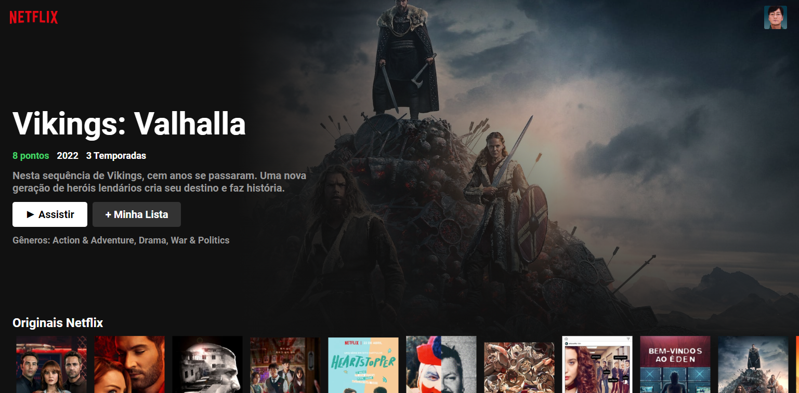
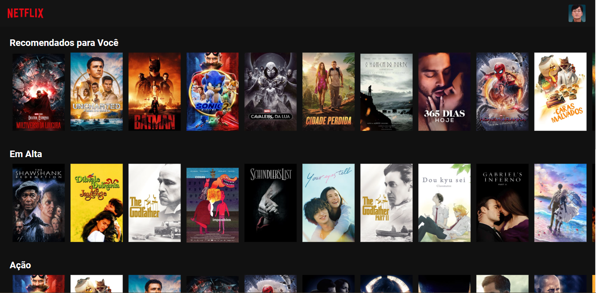
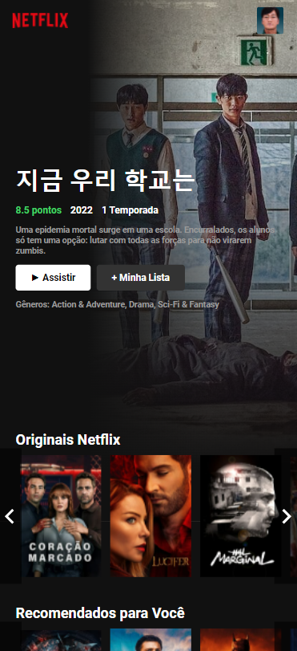

# Clone Interface Netflix

Trata-se de um clone da interface inicial da plataforma Netflix e utiliza dados da API pública [The Movie DB](https://www.themoviedb.org).

Este projeto foi feito baseado em ReactJs, e deploy utilizando Vercel.

<h4 align="center">
	<a href="https://clone-netflix-nine.vercel.app">Demo</a>
</h4>

## ⚙️ Como utilizar (dev)

```
yarn
yarn dev
```

## Screenshots

<span>Versão desktop</span>
 <br/> <br/> <br/>
 <br/><br/><br/>
<span>Versão mobile</span> <br/>



## Desenvolvedor

Feito por [Lucas Guedes](https://www.linkedin.com/in/lucas-guedes-75a25920a/) ♥
